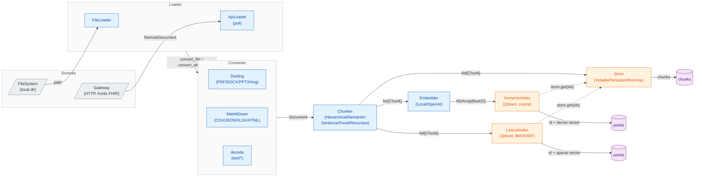
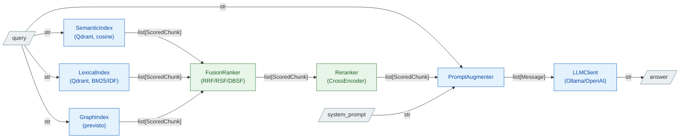

# Autograph RAG — architettura

Due pipeline, cicli di vita separati: **Ingestion** (offline, popola lo store) e **Query** (online, risponde). Sugli archi è indicato l'oggetto che passa da un blocco al successivo.

## Ingestion pipeline (offline)

## Query pipeline (online)

## Tipi che scorrono

| Tipo | Campi |
|---|---|
| `Source` | `id` (nome file o `external_id`), `name`, `origin`, `time`, `access` (attributi ABAC, vuoto senza schema) |
| `Document` | `text`, `source: Source` |
| `Metadata` | `source: Source`, `title`, `page?` |
| `Chunk` | `id` (`source.id` + content_hash), `text`, `metadata: Metadata` |
| `ScoredChunk` | `chunk: Chunk`, `score: float` |
| `Message` | `role` (system/user/assistant), `content` |
