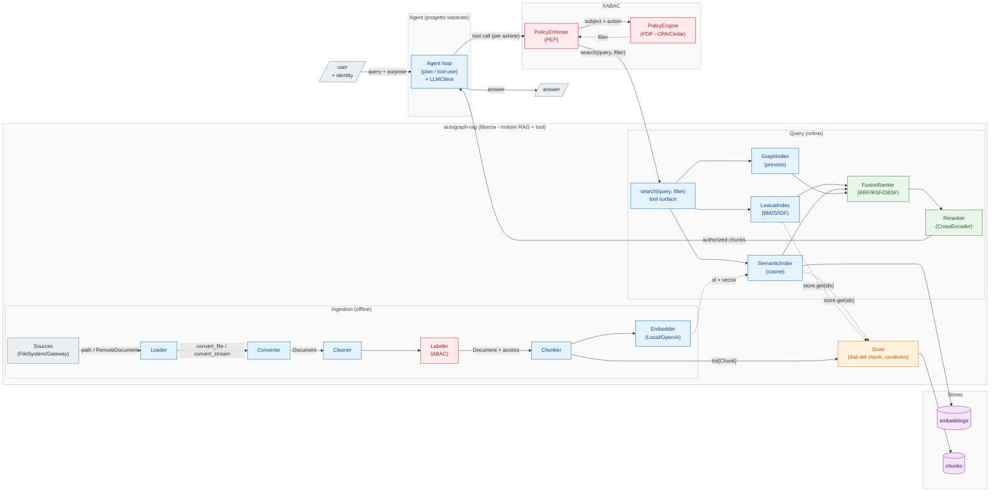
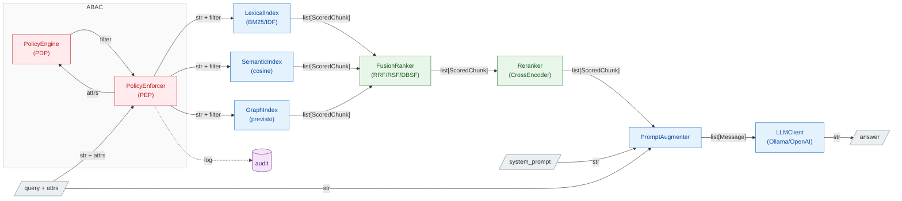

# Roadmap — multi-source + ABAC

Estende [l'architettura di base](architecture.md) su due assi: più **sorgenti** in ingresso
(oltre al filesystem locale, sorgenti remote via HTTP con FHIR dietro un gateway esterno) e un
livello di **controllo accessi ABAC** che, dati gli attributi del richiedente, limita quali chunk
sono raggiungibili in retrieval.

## Stato (7 agosto 2026)

- **Ingestion multi-source — nel base, implementata.** Filesystem locale + sorgenti remote in pull
  via `ApiLoader`, split `Loader` (acquisizione) / `Converter` (parsing). È già descritta in
  [architecture.md](architecture.md): questo doc non la ridisegna, ne fissa le decisioni e ciò che
  resta da fare.
- **ABAC — contratto cablato su entrambi i lati; mancano PEP e propagazione del filtro.** Esistono il `Filter` neutro
  (`authorization/filter.py`) con la costante `Allow`, la semantica di riferimento `evaluate()`, lo
  schema `AccessSchema` (`authorization/schema.py`) e il campo `Source.access`. Lo schema è
  **dichiarato in un file JSON** (`AccessSchema.from_file`, path in `Settings.access_schema_path`) e
  **iniettato dal main** in ciò che ne ha bisogno: la sua presenza o assenza è ciò che distingue un
  deployment con ABAC da uno senza. Su `BaseIndex`: senza schema il filtro resta opzionale e si torna al
  comportamento di prima; con schema il filtro è **obbligatorio** (`Allow()` è come si dichiara di non
  averne), viene validato contro il vocabolario, e un chunk privo degli attributi `required` è negato
  *prima* che il predicato sia valutato. Lato ingestion il **`Labeler`** c'è (`ingestion/labeler.py`):
  gira tra loader e chunker, scrive gli attributi validati su `Source.access` e aggancia
  `validate_access`, con tre implementazioni — propagazione (percorso principale), manifest JSON,
  costanti. Sul ramo remoto `RemoteDocument.access` porta gli attributi del gateway fino a `Source.access`.
  `QueryPipeline.retrieve/query/stream` propagano il filtro agli index senza interpretarlo. **Manca** il PEP,
  che sta fuori dalla libreria; e sul ramo filesystem nessun loader mette ancora attributi su un file locale,
  quindi lì servono `ManifestLabeler` o un sidecar.
- **Store/index rifattorizzati** dopo la prima stesura di questo doc: il retriever non esiste più, i
  dati del chunk stanno in un `Store` condiviso e gli index tengono solo id + rappresentazione. Le
  parti di questo documento che dicono "lo store filtra" vanno lette come "l'index filtra".

> Le prime stesure ipotizzavano FHIR *dentro* la libreria (`FhirLoader`, `RawResource`, Loader
> Registry con `can_handle`) e un campo `attrs` ABAC nei tipi fin da subito. Superato: FHIR vive in un
> **gateway esterno** e **non** c'è nessun campo ABAC nei tipi finché l'ABAC non viene progettato.

## Architettura a tre livelli

Tre confini netti, ognuno un progetto/processo distinto:

1. **`autograph-rag` (questa repo) — motore RAG + superficie-tool.** Resta una libreria in-process.
   L'estensione ABAC aggiunge una `search(query, top_k, filter=...) -> list[ScoredChunk]` **pubblica**:
   è la superficie-tool e `filter` è la cucitura dove l'ABAC spinge il predicato negli index. Niente
   microservizio finché non serve.
2. **ABAC — enforcement a livello dato.** Il **PDP** compila `(subject, action, env)` in un **filtro**,
   il **PEP** lo pusha nella ricerca (pre-filter, mai post-filter). Attributi del subject dall'identità
   verificata, default-deny sui mancanti, audit come obligation. Start con filtro hand-written locale, poi
   **PDP XACML in container esterno** che restituisce il filtro come *obligation* (OPA/Cedar in alternativa).
3. **Agente — progetto separato che importa la lib.** Il loop agentico vive fuori da questa repo e chiama
   `search(...)` come tool. Il **PEP avvolge ogni tool-call** (non una sola query) con l'**identità
   dell'utente immutata** lungo il loop (no confused deputy); è anche il contenimento contro la prompt
   injection.

Filo conduttore — un solo confine ripetuto ovunque: 
> chi decide il filtro sta a monte, chi lo applica sta negli index

Vale identico per la query lineare e per l'agente; cambia solo che l'agente
invoca il PEP a ogni passo.

**Verso un servizio esterno.** Questa architettura *logica* non cambia: un servizio è una scelta di
*deployment* ortogonale. Gli archi che attraversano il confine di processo diventano chiamate di rete e
i contratti (`search`, richiesta/decisione PDP) diventano schemi d'API — motivo per cui vanno definiti
puliti adesso. Primo candidato all'estrazione: il **PDP** (es. OPA server), dove solo `PEP → PDP` diventa
una call HTTP. Si aggiungono concern additivi (propagazione attrs, auth tra servizi, timeout/retry, audit
centralizzato), non un ridisegno.



I box sono confini di progetto/processo; `search(query, filter)` e la richiesta al PDP sono le cuciture
che, verso un servizio esterno, diventano API senza cambiare il flusso. `Labeler` (ingestion) e il
ramo `XABAC` (query) sono le uniche aggiunte rispetto al [base](architecture.md); tutto il resto esiste già.

## Acquisizione ≠ parsing (nel base)

Due assi ortogonali in due astrazioni distinte — già implementate; qui solo il razionale che regge le
estensioni.

- **`Loader`** → *acquisizione*: dove stanno i dati e come tirarli giù. `LocalLoader`/`FileSystemLoader`
  (file su disco, passa un **path**) e `RemoteLoader`/`ApiLoader` (pull HTTP, passa **byte**). Qui vivono
  auth, paginazione, retry, streaming.
- **`Converter`** → *parsing*: trasforma un payload grezzo in testo/markdown in base al **formato**.
  `MarkdownConverter` fa dispatch sul `media_type` (tabella `_PARSER_BY_MEDIA_TYPE`): Docling per
  PDF/DOCX/PPTX/immagini, MarkItDown per CSV/JSON/XLSX/HTML, decode per `text/*`, fail-loud sul resto.

Il routing formato→parser sta **nel converter**, condiviso da filesystem e remoto: un PDF è parsato allo
stesso modo da qualunque sorgente arrivi.

**FHIR non entra qui.** È un *gateway esterno* (altra repo) a parlare FHIR — auth, consenso, paginazione
dei `Bundle`, risoluzione dei `Binary` — e a consegnare alla lib documenti neutri via HTTP: solo "byte +
`media_type`". Sostituisce l'idea originaria di un `FhirLoader`/`RawResource`/Loader Registry in-process.

```python
class RemoteDocument(BaseModel):          # ciò che il gateway garantisce
    data: Base64Bytes                     # payload grezzo (base64 in transito)
    media_type: str                       # "application/pdf", ...
    external_id: str; title: str; time: date
    access: dict[str, ...] = {}   # ciò che il servizio sa e la lib non può inferire

class BaseLoader(ABC):                     # acquisizione
    def load(self) -> Iterator[Document]: ...       # yield, streaming, skip-per-item

class BaseConverter(ABC):                  # parsing
    def convert_stream(self, data: bytes, media_type: str, name: str = "document") -> str: ...
    def convert_file(self, path: Path) -> str: ...
```

Gli attributi ABAC **non** stanno ancora nei tipi: il gancio è un campo `access` sul metadata del chunk,
scritto dal `Labeler` in ingestion — vedi [la sezione sul Labeler](#ingestion-il-labeler-scrive-gli-attributi-risorsa).

## Ingestion: il `Labeler` scrive gli attributi-risorsa

Nel flusso offline il `Labeler` sta **tra loader e chunker** (`LOAD → CONV → CL → TAG → CH`) e **scrive gli
attributi-risorsa sul `Source` del documento**. Le prime stesure lo mettevano tra chunker ed embedder, con
gli attributi sul metadata del chunk: superato quando `access` è passato su `Source`, perché etichettare
dopo il chunking vorrebbe dire riscrivere lo stesso `Source` su N chunk invece che una volta sul documento.
Il chunker copia già `doc.source` dentro ogni `Metadata`, quindi l'eredità è gratuita.

**Implementato** in `ingestion/labeler.py`. `BaseLabeler.label(document) -> Document` è condiviso — valida con
`schema.validate_access` e restituisce una copia con gli attributi su `source.access` — e le sottoclassi
dicono soltanto *da dove vengono i valori*:

- **`PropagatingLabeler`** — gli attributi sono già arrivati col documento (gateway, sidecar): valida e basta.
  È il percorso principale, quello che tiene la lib indipendente da chi produce il corpus.
- **`ManifestLabeler`** — file JSON `{default, sources}` indicizzato su `source.id`, per il corpus curato a
  mano senza nessuno a monte. Un documento non elencato eredita il `default`.
- **`StaticLabeler`** — le stesse costanti per tutto ciò che quella pipeline ingerisce.

Un attributo non valido **solleva**, non salta il documento: un file corrotto è un problema di quel dato e il
loader fa bene a scartarlo, ma un attributo non dichiarato è un disaccordo tra il produttore e la
dichiarazione — riguarda l'intero corpus, e saltare lascerebbe un buco invisibile.

Lo stesso vale per ciò che **manca**: `validate_access` verifica anche che gli attributi `required` ci siano.
Senza, l'ingestione accetterebbe un documento che sa già di non poter mai restituire, e il sintomo
comparirebbe molto dopo — a query time, come lista vuota indistinguibile da un deny legittimo. Il labeler
riavvolge l'errore aggiungendo l'id del documento, che è l'unica cosa che lo schema non può sapere.
`is_labeled` risponde alla stessa domanda **senza** sollevare, perché in retrieval un chunk non etichettato va
negato in silenzio invece che far esplodere la query.

Principio guida, ed è ciò che tiene sano tutto il resto:

> **etichettare ≠ decidere.** Il Labeler marca il dato per *cosa è* (`Access`), non per *chi lo vede*. Le
> regole vivono nel PDP; cambiare una regola non deve **mai** forzare un re-ingest/re-tag.

Per questo l'unico contratto che ingestion e query condividono è lo schema degli attributi, **non** una
`Policy`. Lo schema però **non può essere fisso**: il vocabolario cambia per progetto (`tenant` in uno,
`patient_id`/`care_team` in un altro, `cost_center` in un terzo), e quando gli attributi arrivano da uno
script a monte del PDP i nomi li decide qualcun altro. Quindi è **dichiarato al composition root**:

```python
# authorization/schema.py — implementato
class AttributeType(StrEnum):
    KEYWORD = "keyword"; INTEGER = "integer"; BOOLEAN = "bool"   # = i tipi di payload index

class Attribute(BaseModel):       # extra="forbid": un typo nel file non passa in silenzio
    name: str; type: AttributeType; multi: bool = False; required: bool = False

class AccessSchema:               # il vocabolario chiuso che il deployment dichiara
    @classmethod
    def from_file(cls, path) -> AccessSchema: ...    # lista JSON di attributi, versionata in git
    def validate_access(self, access) -> dict: ...   # cosa il Labeler scrive, in ingestion
    def validate_filter(self, predicate) -> None: ...# cosa il PEP passa, in query
    def is_labeled(self, access) -> bool: ...        # porta i `required`? altrimenti negato

# types.py — implementato
class Source(BaseModel):          # gli attributi stanno qui: sono del documento, non del passaggio
    id: str; name: str; origin: Origin; time: date
    access: dict[str, AttributeValue | list[AttributeValue]] = {}

class Metadata(BaseModel):        # il chunk li eredita portando il suo Source: nessuna copia
    source: Source; title: str; page: int | None = None
```

**Perché su `Source` e non su `Metadata`.** L'accesso è una proprietà del documento sorgente, non della
singola porzione di testo: mettendolo lì ogni chunk lo eredita per costruzione — nessuno copia niente — e
l'enforcement ha **un solo posto** da cui leggere (`chunk.metadata.source.access`). È anche il modello di
produzione: ACL sul documento e chunk che eredita è ciò che fanno Kendra, Azure AI Search e Glean. Il
prezzo è che gli attributi sono *strutturalmente* uniformi per documento — `source.id` è la chiave di
cancellazione e dev'essere identico su tutti i chunk, quindi non esistono `Source` diversi per chunk.
Etichettare una singola sezione diversamente (il caso "inferito", già rimandato) richiederebbe di
reintrodurre un campo per-chunk.

**Una dichiarazione, tre consumatori**: valida ciò che il Labeler scrive, dice a ogni index quali campi
payload indicizzare, e rifiuta un filtro che nomina un attributo mai dichiarato — così un attributo fuori
vocabolario non ha alcun percorso silenzioso.

Il **default-deny** non viene più da un valore restrittivo di default (`CONFIDENTIAL`) ma dalla semantica di
`evaluate`: **un attributo che il chunk non porta non matcha mai**, quindi un chunk non etichettato è negato
invece che leggibile da tutti. Stessa proprietà, meccanismo più generale — non richiede che lo schema
conosca quale valore sia "il più chiuso".

> **Correzione (7 agosto).** Quella semantica da sola non basta: vale per i predicati positivi, non sotto
> negazione. Su un chunk con `access` vuoto, `Not(Match("classification", {"confidential"}))` è **vero** —
> il `Match` interno è falso perché l'attributo manca, e il `Not` lo ribalta. Il default-deny dipendeva
> quindi da come era scritta la policy. Da qui gli attributi `required` nello schema e `is_labeled`,
> valutato in `BaseIndex.retrieve` **prima** del predicato: così il chunk non etichettato è fuori per
> qualunque predicato, `Allow()` compreso, e la garanzia torna a essere una proprietà del punto di
> enforcement invece che dell'autore della policy.

Il nome `Labeler` è in linea col resto della pipeline (`Loader/Converter/Cleaner/Chunker/Embedder`)
e col lessico del controllo accessi (*security/classification label*): etichetta attributi, non policy.

### Da dove nascono i valori: propagati vs inferiti

Due nature diverse, con costo e affidabilità diversi:

- **Propagati** (deterministici, gratis): `tenant`, `source_system`, `origin`, `external_id` vengono dal
  `Source`/`RemoteDocument` — il Labeler li copia. Idempotenti per costruzione.
- **Inferiti** (costosi, fallibili): `classification` e simili possono richiedere un classificatore
  (regola/regex/ML/LLM). Rimandati: allo step 3 si parte assegnando la classification **per-sorgente** (es.
  "tutto ciò che arriva da questo `source_system` è `confidential`"), **non per-contenuto**.

### Il gateway sa cose che la lib non può inferire

Sul percorso remoto il **gateway FHIR conosce attributi che dai soli byte non ricavi**: `patient_id`,
compartment, consenso, sensibilità della risorsa. Li **consegna già** e il Labeler li **propaga**, invece
che tentare di re-inferirli nella lib. **Implementato**: `RemoteDocument.access` porta gli attributi,
`_to_document` li travasa in `Source.access`, il `PropagatingLabeler` li valida. Per i file locali si ha
solo ciò che è derivabile da path/`Source`, o un manifest/sidecar.

Gli attributi sono **annidati** sotto `access` e non piatti sull'envelope perché sono due spazi di nomi
diversi: i campi intorno (`external_id`, `title`, `time`, `media_type`) li decide questo trasporto, le chiavi
dentro `access` le decide `access_schema.json`. Piatti, un attributo dichiarato `title` colliderebbe col
protocollo. Il gateway quindi **legge lo stesso `access_schema.json`** della lib: è lì che sta il vocabolario
in cui deve tradurre FHIR (`meta.security` → `classification`, `subject` → `patient_id`, …).

`origin` invece **non** viene dal payload ma è impostato dal loader: da quale canale è arrivato un documento
è cosa che la lib sa, e un servizio non deve poter dichiarare il contrario.

**Dove sta il file.** La libreria non ha un'opinione, ed è il motivo per cui `Settings.access_schema_path`
non ha default: lo decide chi fa il deployment, che è anche l'unico a poterlo condividere col gateway. Questo
repo ne pubblica solo la **forma** (`access_schema.example.json` alla radice, in coppia con `.env.example`) e
il suo `main.py` lo cerca in `data/`, come già fa per `system_prompt_path`. In un deployment reale è un
contratto versionato e revisionato come codice, letto anche dagli altri progetti che producono attributi.

### Idempotenza

Come per gli id (`content_hash`), il tag dev'essere **stabile per lo stesso contenuto+sorgente**: la
re-ingestione non deve cambiare l'etichetta, o l'upsert idempotente dello store perde senso. È un altro motivo
per preferire i valori *propagati* (deterministici) a quelli *inferiti* finché possibile.

Gli attributi vanno poi promossi a **campi flat indicizzabili** — ma **nell'index, non nello store**. Questa
frase nella prima stesura diceva "lo `add()` dello store": era corretta quando "store" significava
`VectorStore`/`LexicalStore`, cioè prima dello split store/index. Oggi lo store è un docstore chiave→blob
interrogato *dopo* il retrieval, quindi filtrare lì sarebbe post-filtering; il pre-filtro può morde solo
dove si scelgono i candidati, cioè nel payload dell'index (più un `create_payload_index` per campo, altrimenti
il backend filtra scandendo). **Non ancora implementato.**

## Query con enforcement ABAC (target)

Principi non negoziabili:

- La sicurezza si applica **a livello dato, in fase di retrieval — mai in post-filtering** dopo il ranking
  (post-filtrare rompe il top-k e fa leak di *esistenza*).
- **L'LLM non è il confine di sicurezza**: vede solo chunk già autorizzati.
- Ogni decisione è loggata (audit obbligatorio per compliance).

**Precisazione su "pre" e "post"** (la prima stesura non distingueva, e il confine non è dove sembra): il
riferimento è il **ranker**, non gli index.

- Filtrare **prima della fusione** è corretto anche se avviene dopo `_search`. È dove sta oggi, in
  `BaseIndex.retrieve`: i chunk sono già risolti dallo store, quindi non costa una query in più.
- Filtrare **dopo la fusione** è ciò che va escluso, e per un motivo concreto: RRF legge le **posizioni**
  dentro ogni lista e RSF normalizza su **min e max** di ogni lista. Lasciarci dentro chunk non autorizzati
  significa che spostano il rank di quelli autorizzati e fissano i limiti di normalizzazione — cioè il
  punteggio di ciò che vedi dipende da ciò che non puoi vedere. E `top_k` smetterebbe di contare risultati
  autorizzati.

Il controllo vive in `BaseIndex.retrieve` e non in `QueryPipeline` perché gli index sono **API pubblica**:
un utente può chiamare `index.retrieve(query, top_i)` senza pipeline, e un controllo di sicurezza non può
dipendere da quale wrapper è stato scelto. Stando nella classe base, nessun autore di index può ometterlo.

**Il pattern industriale è a due stadi** e ci si incastra: pre-filtro grossolano sugli attributi indicizzabili
(pushdown), **over-fetch**, e filtro fine contro il PDP per ciò che è troppo dinamico da indicizzare. È come
lo fanno Azure AI Search (*security trimming*) ed Elasticsearch (*document-level security*). L'over-fetch è la
risposta operativa al recall che si perde filtrando a valle di `top_i`.



### PEP, PDP, PIP e attributi

Terminologia dal modello ABAC classico (XACML): separa *chi applica* la regola da *chi la decide*.

- **PEP — Policy Enforcement Point.** Il guardiano sul percorso del dato: intercetta la richiesta, chiede
  la decisione al PDP e la **applica**, traducendola in un filtro pushato nella ricerca dei retriever. Non
  conosce le policy — sa solo bloccare/lasciar passare.
- **PDP — Policy Decision Point.** Il cervello: non tocca i dati, riceve `subject + action (+ resource +
  env)`, valuta le policy e restituisce un **predicato di filtro** (es. `tenant == "acme" AND
  classification <= "internal"`). Sostituibile senza toccare la pipeline: prima hand-written, poi OPA/Cedar.
- **PIP — Policy Information Point.** Sorgente per gli attributi **non presenti nel token**, risolti a
  decision-time (es. reparti correnti dell'utente, consenso del paziente ancora valido).

Il filtering non usa solo attributi noti all'auth. Gli attributi sono di quattro tipi e il match avviene a
runtime tra *subject* e *resource*:

| Categoria | Esempio | Origine |
|---|---|---|
| **Subject** | ruolo, tenant, clearance | token/identità (spesso noto all'auth) o PIP |
| **Resource** | classification del chunk, patient_id, source_system | metadata dello store (scritti dal `Labeler` in ingestion) |
| **Action** | read / search | dalla richiesta |
| **Environment** | ora, IP, purpose-of-use, break-glass | contesto per-richiesta |

Conseguenza: `purpose-of-use` ed environment sono **per-richiesta, non per-sessione** (stesso login, filtro
diverso tra una query "per cura" e una "per ricerca") — per questo viaggiano con la query, non col login. Se
il caso reale confrontasse solo attributi statici del token contro tag statici del chunk (multi-tenancy pura),
il filtro degenera in qualcosa di noto all'auth: è il motivo per cui allo step 3 basta la versione
hand-written, tenendo PIP e OPA per quando servono attributi dinamici o consenso.

### PDP esterno XACML: il filtro arriva come *obligation*

Il PDP è un **servizio XACML in un container a sé** (di fatto in Java). Il linguaggio è irrilevante: sta dietro
un confine di rete e parla col motore RAG solo via HTTP (XACML 3.0 JSON), quindi nessun ponte Python↔Java — il
PEP fa una POST e basta.

Il nodo è *come* un PDP XACML restituisce un **filtro** invece di un Permit/Deny per-risorsa. Due strade:

- **reverse-query / data-filtering** (es. Axiomatics ADAF): il motore *deriva* da solo la condizione residua.
  Feature non-standard, spesso commerciale.
- **obligation** (XACML standard, es. AuthzForce): la policy, sul `Permit`, ritorna un'**obligation** che
  *contiene* il filtro. È **la strada scelta**: gira su engine open-source standard, al prezzo che il filtro è
  **autorato nella policy** (parametrizzato sugli attributi del subject), non derivato.

> Verifica sul motore concreto: deve supportare le obligation (tutti gli XACML 3.0 le hanno) — o, se
> disponibile, la reverse-query. Un engine che fa *solo* Permit/Deny per-risorsa non consente il pre-filter.

Flusso: il PEP manda `subject + action + env` (senza risorsa concreta, per la search) → la policy matcha →
`Permit` + obligation `data-filter` → il PEP la traduce nel **`Filter` neutro** → pushdown negli index. L'audit
obbligatorio è **anch'esso un'obligation** (`must-log`), che convive nella stessa risposta.

Le obligation XACML portano coppie `(AttributeId, Value)`, **non operatori**: l'operatore si codifica
nell'obligation-id, con una convenzione mappata dal PEP.

```python
# registro cross-confine: obligation-id -> (campo-store, operatore del Filter neutro)
FILTER_OBLIGATIONS = {
    "urn:acme:filter:classification-max": ("classification", Op.LTE),
    "urn:acme:filter:tenant-eq":          ("tenant",         Op.EQ),
    "urn:acme:filter:source-in":          ("source_system",  Op.IN),
}

def obligations_to_filter(decision, obligations) -> Filter:
    if decision != "Permit":
        return Filter.deny_all()                 # default-deny
    conditions = []
    for ob in obligations:
        if ob.id in FILTER_OBLIGATIONS:
            field, op = FILTER_OBLIGATIONS[ob.id]
            conditions.append(Condition(key=field, op=op, value=ob.value))
        elif ob.id == AUDIT_OBLIGATION:
            continue                             # gestita come log, non è un vincolo
        else:
            return Filter.deny_all()             # REGOLA XACML: obligation non gestita => Deny
    return Filter(conditions=conditions)         # AND delle condizioni
```

**Regola non negoziabile (standard XACML):** un'obligation che il PEP non sa scaricare **deve** essere trattata
come Deny — mai ignorata, sarebbe under-restriction.

### Il `Filter` neutro è il perno

Grammatica piccola e chiusa, **implementata** come algebra di predicati anziché come lista di condizioni in
AND:

```python
Match(attribute, values)   # l'attributo vale uno di quei valori (copre eq e in)
And(a, b, ...)             # rifiuta la congiunzione vuota: sarebbe vera per vacuità -> autorizza tutto
Or(a, b, ...)
Not(a)
Allow()                    # costante vera: "nessuna restrizione", detto esplicitamente
```

`Allow` esiste perché in un deployment con schema il filtro è obbligatorio, e serviva un modo di dire
"questa chiamata non ha restrizioni" **distinto da** "mi sono dimenticato l'argomento": stesso effetto a
runtime di `None`, significato opposto nel codice e nell'audit. Non scavalca `is_labeled` — rinuncia alla
policy, non all'integrità dello schema. Il suo speculare è il deny canonico (`Match` senza valori).

Rispetto alla prima stesura: `Or` e `Not` non erano previsti e ci sono; **`lte` non c'è**, quindi un
`classification <= "internal"` oggi **non è esprimibile** e va espanso in `Match("classification", {"public",
"internal"})`. Se le classificazioni ordinate diventano numerose vale aggiungere un operatore d'ordine, ma
finché sono tre l'enumerazione è più semplice e non introduce il problema di dichiarare l'ordine nello schema.

`evaluate(predicate, access)` è la **semantica di riferimento** dell'algebra, e ha tre ruoli: è il fallback per
i backend che non filtrano, è l'enforcement autorevole in `BaseIndex.retrieve`, e diventa l'**oracolo** contro
cui testare ogni pushdown — un push deve dare lo stesso insieme che la valutazione in Python.

La traduzione per backend resta il pushdown, come ottimizzazione: `models.Filter(must=[FieldCondition(...)])`
per Qdrant. **Non ancora implementata.**

Isola il resto da due assi: dal **backend** (si cambia motore senza toccare PEP/PDP) e dal fatto che il **PDP
sia Java/XACML** (si cambia engine senza toccare l'index).

**Il caveat FAISS è superato.** La prima stesura concludeva che un backend che non filtra per metadata non può
fare enforcement, quindi l'in-memory restava un PoC. Non è più vero: con `evaluate` in `BaseIndex.retrieve`
l'enforcement è in Python e vale per **qualunque** backend, compresi quelli scritti da terzi. Il pushdown
cambia solo il recall e le prestazioni, non se il filtro c'è.

### Aperto: l'ABAC sul `GraphIndex`

Sui due index per similarità il filtro è una condizione sulla **selezione dei candidati**. Sul grafo no: il
grafo espande per **traversal**, quindi il filtro interagisce con la *raggiungibilità* — il sottografo
percorribile è diverso per ogni soggetto, e i cammini che esistono per uno non esistono per un altro.

Il vincolo strutturale: un nodo-concetto mergiato per nome appartiene a **più chunk con accessi diversi**,
quindi **non può portare una etichetta di accesso**. Gli archi sì: l'LLM estrae ciascun arco leggendo **un
solo** chunk, quindi ogni arco ha una provenienza univoca. Da qui le due posizioni:

- **Attributi sugli archi, filtro a ogni hop** (`all(e IN r WHERE ...)` in Cypher). Dà espansione
  dimostrabilmente chiusa: il sottografo raggiunto deriva solo da dati che il soggetto può vedere. Prezzo: un
  costrutto critico per la sicurezza, dove un errore è un leak silenzioso e la copertura con test è difficile.
- **Traversal libero, filtro sui chunk risultanti** (posizione del CTO). Uniforme — gli attributi restano solo
  sul chunk, un solo punto di filtro, testabile con una funzione — e nessuna duplicazione di dati di sicurezza
  nel grafo, quindi nessun rischio di staleness.

Cosa è realmente in gioco: **non un leak di contenuto**, perché `_search` restituisce solo `(chunk_id, score)`
e i nodi intermedi non sono osservabili. È un **canale inferenziale**: un cammino che passa per chunk vietati
può far risalire in classifica un chunk *autorizzato* che altrimenti non c'entrava, quindi l'ordinamento di ciò
che vedi dipende da ciò che non vedi — e con molte query mirate diventa sondabile.

**Da decidere prima di scrivere il grafo**, perché determina dove vanno gli attributi. E se si scegliesse la
seconda, va aggiunto l'**over-fetch** e va annotato qui che il principio "mai post-filtering" è stato
consapevolmente derogato per il solo stadio di espansione — dove costa bonus mancati, non risultati primari
mancati.

### Il chatbot non decide l'autorizzazione

| | Chi decide | Da dove |
|---|---|---|
| **Rilevanza** (cosa è pertinente) | LLM / retrieval | il testo della query |
| **Autorizzazione** (cosa hai diritto di vedere) | PEP/PDP | identità verificata + scope fidato |

Filtro finale = **`sicurezza (PEP, non negoziabile) AND rilevanza (LLM, opzionale)`**: l'LLM può solo
**restringere** dentro ciò che la sicurezza permette, mai allargare. Gli attributi del subject vengono dal
**token verificato** (immutabile lungo il loop dell'agente, no confused deputy); `purpose-of-use`/scope da un
**controllo UI fidato**, validato contro le entitlement — mai dedotto dall'LLM. È questo che rende la prompt
injection irrilevante ai fini dell'accesso: l'identità viaggia accanto alla tool-call, non dentro il prompt.

## Decisioni prese (priorità: semplicità)

- **FHIR fuori dalla lib, da subito** — gateway esterno in pull via `ApiLoader`; isola
  credenziali/compliance sanitaria fuori dal motore RAG.
- **La lib parsa i payload**, non il gateway: pipeline di estrazione unica, qualità controllata dalla lib
  (il gateway consegna byte grezzi + `media_type`).
- **Acquisizione (`Loader`) ≠ parsing (`Converter`)**; routing formato→parser nel converter su
  `media_type`, non un Loader Registry.
- **`load()` con `yield` + skip-per-item**: un file/record guasto viene saltato e loggato, non aborta il batch.
- **Nessun campo ABAC nei tipi** finché non si progetta *(superato: progettato)*; il gancio è `Source.access`,
  ereditato da ogni chunk via `Metadata.source`.
- **ABAC minimo prima del motore** *(futuro)*: 1–2 attributi come tag nel metadata + funzione che traduce
  gli attributi del subject in un metadata-filter pushato nella ANN search. OPA/Cedar/Casbin **solo** quando
  le policy diventano condizionali/gerarchiche.
- **PDP = servizio XACML esterno (container, di fatto Java)**: confine di rete, contratto JSON; il linguaggio
  del motore è irrilevante alla lib. Nel nostro codice non si modella nessuna `Policy`.
- **Filtro via obligation, non reverse-query**: gira su engine XACML standard/open-source (es. AuthzForce); il
  filtro è autorato nella policy come obligation, tradotto dal PEP nel `Filter` neutro. Obligation non gestita
  ⇒ Deny.
- **`Filter` neutro come perno**, come algebra `Match`/`And`/`Or`/`Not` (senza `lte`: le classificazioni
  ordinate si enumerano). L'enforcement è **in Python** in `BaseIndex.retrieve` via `evaluate()`, quindi vale
  per **ogni** backend — il pushdown nel payload dell'index resta un'ottimizzazione per il recall, non la
  condizione perché il filtro esista.
- **Il legame ingestion↔query è lo schema attributi-risorsa + il registro obligation-id**, non una classe
  `Policy`; il `Labeler` resta policy-agnostico (etichetta *cosa è* il dato, non *chi lo vede*). Lo schema è
  **dichiarato al composition root** (`AccessSchema`), non un modello fisso: il vocabolario cambia per
  progetto e spesso lo decide chi sta a monte del PDP.
- **Chatbot: rilevanza (LLM) ≠ autorizzazione (identità + scope fidato)**; due filtri composti, l'LLM può solo
  restringere.
- **Multi-tenancy** *(futuro)*: singola collection + filtro; namespace/collection per tenant o tier di
  classificazione se serve isolamento forte; con pgvector, Row-Level Security come difesa in profondità.

## Sequenza di rilascio

1. ✅ **Fatto — split acquisizione/parsing (in-process)**: `BaseLoader` (Local/Remote) + `ApiLoader` (pull
   HTTP), `BaseConverter`/`MarkdownConverter` con dispatch su `media_type`, `RemoteDocument` come contratto
   neutro, `load()` con `yield` + skip-per-item. *No FTP, no policy engine, no `attrs`.*
2. **Gateway FHIR (altra repo)** — servizio esterno che parla FHIR e alimenta la lib via `ApiLoader`.
   Cablaggio nella lib: aggiungere `gateway_url` a `Settings` e scegliere filesystem/gateway all'avvio.
3. **ABAC hand-written (in-process)** — ⚙️ *parzialmente fatto*. Fatto: `Filter` (con `Allow`), `evaluate()`,
   `AccessSchema` caricato da file e iniettato dal main, `Source.access`, e in `BaseIndex.retrieve` il
   filtro obbligatorio quando c'è uno schema, la sua validazione contro il vocabolario e il deny dei chunk
   senza attributi `required`. Fatti anche il `Labeler`, che aggancia `validate_access`, e la propagazione del filtro da `QueryPipeline`.
   Resta il PEP con `compile_filter(subject, action, env) -> Filter`, che però vive fuori dalla libreria:
   ha bisogno dell'identità verificata, che la lib non vede mai.
   L'enforcement vale già su ogni backend; il pushdown nel payload è additivo e si aggiunge quando la
   **selettività misurata** lo richiede.
4. **PDP XACML esterno (container)** — si sostituisce il `compile_filter` locale con l'hop al servizio XACML
   dietro la **stessa interfaccia**; il filtro arriva come **obligation** tradotta nel `Filter` neutro.
   Verificare il supporto obligation/reverse-query del motore. OPA/Cedar restano alternative.
