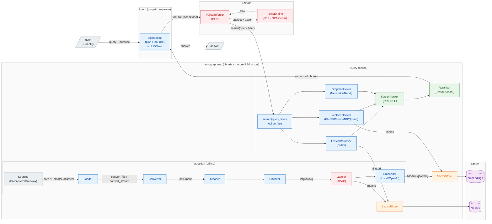
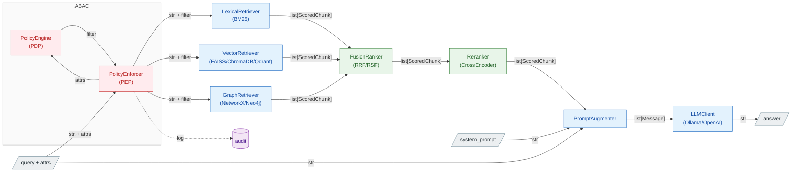

# Roadmap — multi-source + ABAC

Estende [l'architettura di base](architecture.md) su due assi: più **sorgenti** in ingresso
(oltre al filesystem locale, sorgenti remote via HTTP con FHIR dietro un gateway esterno) e un
livello di **controllo accessi ABAC** che, dati gli attributi del richiedente, limita quali chunk
sono raggiungibili in retrieval.

## Stato (16 luglio 2026)

- **Ingestion multi-source — nel base, implementata.** Filesystem locale + sorgenti remote in pull
  via `ApiLoader`, split `Loader` (acquisizione) / `Converter` (parsing). È già descritta in
  [architecture.md](architecture.md): questo doc non la ridisegna, ne fissa le decisioni e ciò che
  resta da fare.
- **ABAC — visione futura, non ancora costruita.** È il grosso di questo documento.

> Le prime stesure ipotizzavano FHIR *dentro* la libreria (`FhirLoader`, `RawResource`, Loader
> Registry con `can_handle`) e un campo `attrs` ABAC nei tipi fin da subito. Superato: FHIR vive in un
> **gateway esterno** e **non** c'è nessun campo ABAC nei tipi finché l'ABAC non viene progettato.

## Architettura a tre livelli

Tre confini netti, ognuno un progetto/processo distinto:

1. **`autograph-rag` (questa repo) — motore RAG + superficie-tool.** Resta una libreria in-process.
   L'estensione ABAC aggiunge una `search(query, top_k, filter=...) -> list[ScoredChunk]` **pubblica**:
   è la superficie-tool e `filter` è la cucitura dove l'ABAC spinge il predicato nello store. Niente
   microservizio finché non serve.
2. **ABAC — enforcement a livello dato.** Il **PDP** compila `(subject, action, env)` in un **filtro**,
   il **PEP** lo pusha nella ricerca (pre-filter, mai post-filter). Attributi del subject dall'identità
   verificata, default-deny sui mancanti, audit come obligation. Start con filtro hand-written locale, poi
   **PDP XACML in container esterno** che restituisce il filtro come *obligation* (OPA/Cedar in alternativa).
3. **Agente — progetto separato che importa la lib.** Il loop agentico vive fuori da questa repo e chiama
   `search(...)` come tool. Il **PEP avvolge ogni tool-call** (non una sola query) con l'**identità
   dell'utente immutata** lungo il loop (no confused deputy); è anche il contenimento contro la prompt
   injection.

Filo conduttore — un solo confine ripetuto ovunque: 
> chi decide il filtro sta a monte, chi lo applica sta nello store

Vale identico per la query lineare e per l'agente; cambia solo che l'agente
invoca il PEP a ogni passo.

**Verso un servizio esterno.** Questa architettura *logica* non cambia: un servizio è una scelta di
*deployment* ortogonale. Gli archi che attraversano il confine di processo diventano chiamate di rete e
i contratti (`search`, richiesta/decisione PDP) diventano schemi d'API — motivo per cui vanno definiti
puliti adesso. Primo candidato all'estrazione: il **PDP** (es. OPA server), dove solo `PEP → PDP` diventa
una call HTTP. Si aggiungono concern additivi (propagazione attrs, auth tra servizi, timeout/retry, audit
centralizzato), non un ridisegno.



I box sono confini di progetto/processo; `search(query, filter)` e la richiesta al PDP sono le cuciture
che, verso un servizio esterno, diventano API senza cambiare il flusso. `Labeler` (ingestion) e il
ramo `XABAC` (query) sono le uniche aggiunte rispetto al [base](architecture.md); tutto il resto esiste già.

## Acquisizione ≠ parsing (nel base)

Due assi ortogonali in due astrazioni distinte — già implementate; qui solo il razionale che regge le
estensioni.

- **`Loader`** → *acquisizione*: dove stanno i dati e come tirarli giù. `LocalLoader`/`FileSystemLoader`
  (file su disco, passa un **path**) e `RemoteLoader`/`ApiLoader` (pull HTTP, passa **byte**). Qui vivono
  auth, paginazione, retry, streaming.
- **`Converter`** → *parsing*: trasforma un payload grezzo in testo/markdown in base al **formato**.
  `MarkdownConverter` fa dispatch sul `media_type` (tabella `_PARSER_BY_MEDIA_TYPE`): Docling per
  PDF/DOCX/PPTX/immagini, MarkItDown per CSV/JSON/XLSX/HTML, decode per `text/*`, fail-loud sul resto.

Il routing formato→parser sta **nel converter**, condiviso da filesystem e remoto: un PDF è parsato allo
stesso modo da qualunque sorgente arrivi.

**FHIR non entra qui.** È un *gateway esterno* (altra repo) a parlare FHIR — auth, consenso, paginazione
dei `Bundle`, risoluzione dei `Binary` — e a consegnare alla lib documenti neutri via HTTP: solo "byte +
`media_type`". Sostituisce l'idea originaria di un `FhirLoader`/`RawResource`/Loader Registry in-process.

```python
class RemoteDocument(BaseModel):          # ciò che il gateway garantisce
    data: Base64Bytes                     # payload grezzo (base64 in transito)
    media_type: str                       # "application/pdf", ...
    external_id: str; title: str; ingested_at: date

class BaseLoader(ABC):                     # acquisizione
    def load(self) -> Iterator[Document]: ...       # yield, streaming, skip-per-item

class BaseConverter(ABC):                  # parsing
    def convert_stream(self, data: bytes, media_type: str, name: str = "document") -> str: ...
    def convert_file(self, path: Path) -> str: ...
```

Gli attributi ABAC **non** stanno ancora nei tipi: il gancio è un campo `access` sul metadata del chunk,
scritto dal `Labeler` in ingestion — vedi [la sezione sul Labeler](#ingestion-il-labeler-scrive-gli-attributi-risorsa).

## Ingestion: il `Labeler` scrive gli attributi-risorsa

Nel flusso offline il `Labeler` sta tra chunker ed embedder (`CH → TAG → EMB`) e **scrive gli attributi-risorsa
sul metadata del chunk**. Principio guida, ed è ciò che tiene sano tutto il resto:

> **etichettare ≠ decidere.** Il Labeler marca il dato per *cosa è* (`Access`), non per *chi lo vede*. Le
> regole vivono nel PDP; cambiare una regola non deve **mai** forzare un re-ingest/re-tag.

Per questo l'unico contratto che ingestion e query condividono è lo schema `Access`, **non** una `Policy`:

```python
class Classification(StrEnum):
    PUBLIC = "public"; INTERNAL = "internal"; CONFIDENTIAL = "confidential"

class Access(BaseModel):          # attributi-RISORSA, non regole
    classification: Classification = Classification.CONFIDENTIAL   # default restrittivo (deny-friendly)
    tenant: str | None = None
    source_system: str | None = None
    # patient_id, ... quando servono

class Metadata(BaseModel):        # il gancio sul chunk
    source: Source
    title: str
    page: int | None = None
    access: Access = Field(default_factory=Access)
```

Il default **più restrittivo** (`CONFIDENTIAL`) è voluto: un chunk non etichettato resta chiuso, coerente col
default-deny. Il nome `Labeler` è in linea col resto della pipeline (`Loader/Converter/Cleaner/Chunker/Embedder`)
e col lessico del controllo accessi (*security/classification label*): etichetta attributi, non policy.

### Da dove nascono i valori: propagati vs inferiti

Due nature diverse, con costo e affidabilità diversi:

- **Propagati** (deterministici, gratis): `tenant`, `source_system`, `origin`, `external_id` vengono dal
  `Source`/`RemoteDocument` — il Labeler li copia. Idempotenti per costruzione.
- **Inferiti** (costosi, fallibili): `classification` e simili possono richiedere un classificatore
  (regola/regex/ML/LLM). Rimandati: allo step 3 si parte assegnando la classification **per-sorgente** (es.
  "tutto ciò che arriva da questo `source_system` è `confidential`"), **non per-contenuto**.

### Il gateway sa cose che la lib non può inferire

Sul percorso remoto il **gateway FHIR conosce attributi che dai soli byte non ricavi**: `patient_id`,
compartment, consenso, sensibilità della risorsa. Ha senso che li **consegni già** (campi aggiuntivi su
`RemoteDocument`) e il Labeler li **propaghi**, invece di tentare di re-inferirli nella lib. Per i file locali
si ha solo ciò che è derivabile da path/`Source`. → possibile estensione futura di `RemoteDocument` con gli
attributi-risorsa noti al gateway.

### Idempotenza

Come per gli id (`content_hash`), il tag dev'essere **stabile per lo stesso contenuto+sorgente**: la
re-ingestione non deve cambiare l'etichetta, o l'upsert idempotente dello store perde senso. È un altro motivo
per preferire i valori *propagati* (deterministici) a quelli *inferiti* finché possibile.

Lo `add()` dello store poi promuove `access` a **campi flat indicizzabili** — è il prerequisito del pushdown
descritto sotto.

## Query con enforcement ABAC (target)

Principi non negoziabili:

- La sicurezza si applica **a livello dato, in fase di retrieval — mai in post-filtering** dopo il ranking
  (post-filtrare rompe il top-k e fa leak di *esistenza*).
- **L'LLM non è il confine di sicurezza**: vede solo chunk già autorizzati.
- Ogni decisione è loggata (audit obbligatorio per compliance).



### PEP, PDP, PIP e attributi

Terminologia dal modello ABAC classico (XACML): separa *chi applica* la regola da *chi la decide*.

- **PEP — Policy Enforcement Point.** Il guardiano sul percorso del dato: intercetta la richiesta, chiede
  la decisione al PDP e la **applica**, traducendola in un filtro pushato nella ricerca dei retriever. Non
  conosce le policy — sa solo bloccare/lasciar passare.
- **PDP — Policy Decision Point.** Il cervello: non tocca i dati, riceve `subject + action (+ resource +
  env)`, valuta le policy e restituisce un **predicato di filtro** (es. `tenant == "acme" AND
  classification <= "internal"`). Sostituibile senza toccare la pipeline: prima hand-written, poi OPA/Cedar.
- **PIP — Policy Information Point.** Sorgente per gli attributi **non presenti nel token**, risolti a
  decision-time (es. reparti correnti dell'utente, consenso del paziente ancora valido).

Il filtering non usa solo attributi noti all'auth. Gli attributi sono di quattro tipi e il match avviene a
runtime tra *subject* e *resource*:

| Categoria | Esempio | Origine |
|---|---|---|
| **Subject** | ruolo, tenant, clearance | token/identità (spesso noto all'auth) o PIP |
| **Resource** | classification del chunk, patient_id, source_system | metadata dello store (scritti dal `Labeler` in ingestion) |
| **Action** | read / search | dalla richiesta |
| **Environment** | ora, IP, purpose-of-use, break-glass | contesto per-richiesta |

Conseguenza: `purpose-of-use` ed environment sono **per-richiesta, non per-sessione** (stesso login, filtro
diverso tra una query "per cura" e una "per ricerca") — per questo viaggiano con la query, non col login. Se
il caso reale confrontasse solo attributi statici del token contro tag statici del chunk (multi-tenancy pura),
il filtro degenera in qualcosa di noto all'auth: è il motivo per cui allo step 3 basta la versione
hand-written, tenendo PIP e OPA per quando servono attributi dinamici o consenso.

### PDP esterno XACML: il filtro arriva come *obligation*

Il PDP è un **servizio XACML in un container a sé** (di fatto in Java). Il linguaggio è irrilevante: sta dietro
un confine di rete e parla col motore RAG solo via HTTP (XACML 3.0 JSON), quindi nessun ponte Python↔Java — il
PEP fa una POST e basta.

Il nodo è *come* un PDP XACML restituisce un **filtro** invece di un Permit/Deny per-risorsa. Due strade:

- **reverse-query / data-filtering** (es. Axiomatics ADAF): il motore *deriva* da solo la condizione residua.
  Feature non-standard, spesso commerciale.
- **obligation** (XACML standard, es. AuthzForce): la policy, sul `Permit`, ritorna un'**obligation** che
  *contiene* il filtro. È **la strada scelta**: gira su engine open-source standard, al prezzo che il filtro è
  **autorato nella policy** (parametrizzato sugli attributi del subject), non derivato.

> Verifica sul motore concreto: deve supportare le obligation (tutti gli XACML 3.0 le hanno) — o, se
> disponibile, la reverse-query. Un engine che fa *solo* Permit/Deny per-risorsa non consente il pre-filter.

Flusso: il PEP manda `subject + action + env` (senza risorsa concreta, per la search) → la policy matcha →
`Permit` + obligation `data-filter` → il PEP la traduce nel **`Filter` neutro** → pushdown nello store. L'audit
obbligatorio è **anch'esso un'obligation** (`must-log`), che convive nella stessa risposta.

Le obligation XACML portano coppie `(AttributeId, Value)`, **non operatori**: l'operatore si codifica
nell'obligation-id, con una convenzione mappata dal PEP.

```python
# registro cross-confine: obligation-id -> (campo-store, operatore del Filter neutro)
FILTER_OBLIGATIONS = {
    "urn:acme:filter:classification-max": ("classification", Op.LTE),
    "urn:acme:filter:tenant-eq":          ("tenant",         Op.EQ),
    "urn:acme:filter:source-in":          ("source_system",  Op.IN),
}

def obligations_to_filter(decision, obligations) -> Filter:
    if decision != "Permit":
        return Filter.deny_all()                 # default-deny
    conditions = []
    for ob in obligations:
        if ob.id in FILTER_OBLIGATIONS:
            field, op = FILTER_OBLIGATIONS[ob.id]
            conditions.append(Condition(key=field, op=op, value=ob.value))
        elif ob.id == AUDIT_OBLIGATION:
            continue                             # gestita come log, non è un vincolo
        else:
            return Filter.deny_all()             # REGOLA XACML: obligation non gestita => Deny
    return Filter(conditions=conditions)         # AND delle condizioni
```

**Regola non negoziabile (standard XACML):** un'obligation che il PEP non sa scaricare **deve** essere trattata
come Deny — mai ignorata, sarebbe under-restriction.

### Il `Filter` neutro è il perno

Grammatica piccola e chiusa (`eq` / `in` / `lte` / `and`), tradotta da ogni backend nel suo dialetto:

- **Chroma** → `where` dict (`{"classification": {"$lte": "internal"}}`)
- **Qdrant** → `models.Filter(must=[FieldCondition(...)])`

Isola il resto da due assi: dal **backend** (Chroma↔Qdrant senza toccare PEP/PDP) e dal fatto che il **PDP sia
Java/XACML** (si cambia engine senza toccare lo store). Prerequisito: `add()` deve scrivere gli attributi di
`Access` come **campi flat indicizzabili**, non nel blob serializzato del chunk (com'è oggi), altrimenti non c'è
nulla su cui filtrare.

**Caveat FAISS:** l'`InMemoryVectorStore` (FAISS flat) **non filtra per metadata** — cercare i candidati e
filtrarli dopo sarebbe post-filter. Quindi l'enforcement ABAC vive su **Chroma/Qdrant**; l'in-memory resta un
PoC senza enforcement.

### Il chatbot non decide l'autorizzazione

| | Chi decide | Da dove |
|---|---|---|
| **Rilevanza** (cosa è pertinente) | LLM / retrieval | il testo della query |
| **Autorizzazione** (cosa hai diritto di vedere) | PEP/PDP | identità verificata + scope fidato |

Filtro finale = **`sicurezza (PEP, non negoziabile) AND rilevanza (LLM, opzionale)`**: l'LLM può solo
**restringere** dentro ciò che la sicurezza permette, mai allargare. Gli attributi del subject vengono dal
**token verificato** (immutabile lungo il loop dell'agente, no confused deputy); `purpose-of-use`/scope da un
**controllo UI fidato**, validato contro le entitlement — mai dedotto dall'LLM. È questo che rende la prompt
injection irrilevante ai fini dell'accesso: l'identità viaggia accanto alla tool-call, non dentro il prompt.

## Decisioni prese (priorità: semplicità)

- **FHIR fuori dalla lib, da subito** — gateway esterno in pull via `ApiLoader`; isola
  credenziali/compliance sanitaria fuori dal motore RAG.
- **La lib parsa i payload**, non il gateway: pipeline di estrazione unica, qualità controllata dalla lib
  (il gateway consegna byte grezzi + `media_type`).
- **Acquisizione (`Loader`) ≠ parsing (`Converter`)**; routing formato→parser nel converter su
  `media_type`, non un Loader Registry.
- **`load()` con `yield` + skip-per-item**: un file/record guasto viene saltato e loggato, non aborta il batch.
- **Nessun campo ABAC nei tipi** finché non si progetta; il gancio sarà un metadata generico sul chunk.
- **ABAC minimo prima del motore** *(futuro)*: 1–2 attributi come tag nel metadata + funzione che traduce
  gli attributi del subject in un metadata-filter pushato nella ANN search. OPA/Cedar/Casbin **solo** quando
  le policy diventano condizionali/gerarchiche.
- **PDP = servizio XACML esterno (container, di fatto Java)**: confine di rete, contratto JSON; il linguaggio
  del motore è irrilevante alla lib. Nel nostro codice non si modella nessuna `Policy`.
- **Filtro via obligation, non reverse-query**: gira su engine XACML standard/open-source (es. AuthzForce); il
  filtro è autorato nella policy come obligation, tradotto dal PEP nel `Filter` neutro. Obligation non gestita
  ⇒ Deny.
- **`Filter` neutro come perno** (`eq`/`in`/`lte`/`and`): enforcement solo sui backend filtrabili
  (Chroma/Qdrant), l'in-memory FAISS resta PoC; `add()` scrive gli attributi flat.
- **Il legame ingestion↔query è lo schema attributi-risorsa (`Access` sul metadata) + il registro
  obligation-id**, non una classe `Policy`; il `Labeler` resta policy-agnostico (etichetta *cosa è* il
  dato, non *chi lo vede*).
- **Chatbot: rilevanza (LLM) ≠ autorizzazione (identità + scope fidato)**; due filtri composti, l'LLM può solo
  restringere.
- **Multi-tenancy** *(futuro)*: singola collection + filtro; namespace/collection per tenant o tier di
  classificazione se serve isolamento forte; con pgvector, Row-Level Security come difesa in profondità.

## Sequenza di rilascio

1. ✅ **Fatto — split acquisizione/parsing (in-process)**: `BaseLoader` (Local/Remote) + `ApiLoader` (pull
   HTTP), `BaseConverter`/`MarkdownConverter` con dispatch su `media_type`, `RemoteDocument` come contratto
   neutro, `load()` con `yield` + skip-per-item. *No FTP, no policy engine, no `attrs`.*
2. **Gateway FHIR (altra repo)** — servizio esterno che parla FHIR e alimenta la lib via `ApiLoader`.
   Cablaggio nella lib: aggiungere `gateway_url` a `Settings` e scegliere filesystem/gateway all'avvio.
3. **ABAC hand-written (in-process)** — `Labeler` scrive `Access` sul metadata del chunk; `add()`
   indicizza gli attributi flat; `search(query, top_k, filter)` pubblica con pushdown su Chroma/Qdrant; PDP
   locale come **funzione** `compile_filter(subject, action, env) -> Filter` dietro l'interfaccia del PEP.
   Enforcement solo sui backend filtrabili.
4. **PDP XACML esterno (container)** — si sostituisce il `compile_filter` locale con l'hop al servizio XACML
   dietro la **stessa interfaccia**; il filtro arriva come **obligation** tradotta nel `Filter` neutro.
   Verificare il supporto obligation/reverse-query del motore. OPA/Cedar restano alternative.
</content>
</invoke>
