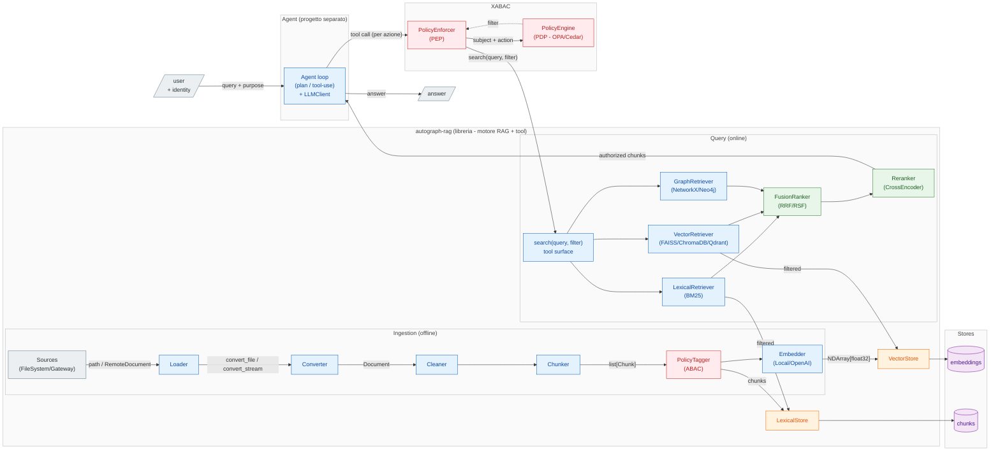
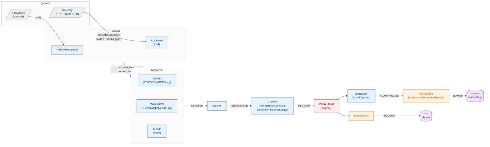
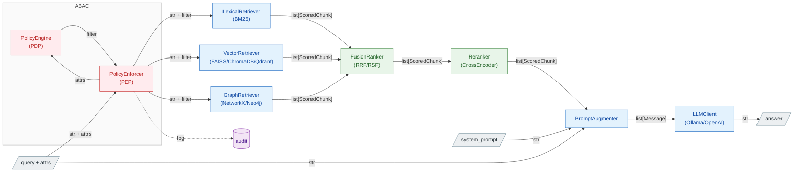

# Roadmap — multi-source + ABAC

Estensione della [pipeline di ingestion](architecture.md): più **sorgenti** in ingresso (oltre al
filesystem locale: sorgenti remote via HTTP, con FHIR dietro un gateway esterno) e un livello di
**controllo accessi ABAC** che, dati certi attributi del richiedente, limita quali embedding sono
raggiungibili.

> **Stato (14 luglio 2026).** La parte *ingestion multi-source* è **implementata**, ma con un design
> diverso da quanto ipotizzavano le prime stesure di questo doc: **FHIR non entra nella libreria** — lo
> gestisce un **gateway esterno** (altra repo) che la lib interroga in pull. La lib resta generica:
> `BaseLoader` (famiglia Local/Remote) per l'*acquisizione* e `BaseConverter`/`MarkdownConverter` per il
> *parsing*. Niente `RawResource`, niente Loader Registry con `can_handle`, niente `attrs` ABAC nei tipi
> (rimandato). Le sezioni ingestion qui sotto sono aggiornate a ciò che esiste; la parte **ABAC** resta
> visione futura non ancora costruita.

Documento di *design* + stato: fissa le decisioni prese e la sequenza.

## Architettura consigliata (sintesi)

Tre livelli, ognuno un confine netto:

1. **`autograph-rag` (questa repo) — motore RAG + superficie-tool.** Resta una **libreria in-process**.
   Due aggiunte: lo split `Source`/`Loader` (con `RawResource.attrs` fin da subito) e una
   `search(query, top_k, filter=...) -> list[ScoredChunk]` **pubblica** — è la superficie-tool e `filter`
   è la cucitura dove l'ABAC spinge il predicato nello store. Niente microservizio finché non serve.
2. **ABAC — enforcement a livello dato.** Il **PDP** compila `(subject, action, env)` in un **filtro**, il
   **PEP** lo pusha nella ricerca (pre-filter, mai post-filter). Attributi del subject dall'identità
   verificata, default-deny sugli attributi mancanti, audit come obligation. Start con filtro hand-written;
   OPA/Cedar solo quando le policy diventano condizionali.
3. **Agente — progetto separato che importa la lib.** Il loop agentico vive fuori da questa repo e chiama
   `search(...)` come tool. In modalità agentica il **PEP avvolge ogni tool-call** (non una sola query), con
   l'**identità dell'utente immutata** lungo il loop (no confused deputy); è anche il contenimento contro la
   prompt injection.

Filo conduttore — un solo confine ripetuto ovunque: **chi decide il filtro sta a monte (PEP), chi lo applica
sta nello store**. Vale identico per la query lineare e per l'agente; cambia solo che l'agente invoca il PEP a
ogni passo.

**Verso un servizio esterno.** Questa architettura *logica* (ruoli, contratti, flusso) **non cambia**: un
servizio è una scelta di *deployment* ortogonale. Gli archi che attraversano il confine di processo diventano
chiamate di rete e i contratti (`Source.fetch`, `search`, richiesta/decisione PDP) diventano schemi d'API —
motivo per cui vanno definiti puliti adesso. Il primo candidato naturale all'estrazione è il **PDP** (es. OPA
server): il box `XABAC` resta identico, solo `PEP → PDP` diventa una call HTTP. Si aggiungono concern additivi
(propagazione degli attrs nella richiesta, auth tra servizi, timeout/retry, audit centralizzato), non un ridisegno.

**Sequenza pratica**: split acquisizione/parsing (fatto) → gateway FHIR esterno in pull → `search()` con
`filter` → ABAC hand-written → agente esterno → (solo se serve) OPA.

I tre livelli e le cuciture (contratti sugli archi). I box sono confini di progetto/processo: `search(query, filter)`
e la richiesta al PDP sono le cuciture che, verso un servizio esterno, diventano API senza cambiare il flusso.



## Principio di base: acquisizione ≠ parsing

Due assi ortogonali, tenuti in due astrazioni distinte:

- **`Loader`** → *acquisizione*: dove stanno i dati e come tirarli giù. Due famiglie:
  `LocalLoader`/`FileSystemLoader` (file su disco) e `RemoteLoader`/`ApiLoader` (pull HTTP da un servizio
  esterno). Qui vivono auth, paginazione, retry, streaming.
- **`Converter`** → *parsing*: trasforma un payload grezzo in testo/markdown in base al **formato**.
  `MarkdownConverter` fa dispatch sul `media_type` (Docling per PDF/DOCX/PPTX/immagini, MarkItDown per
  CSV/JSON/XLSX/HTML, decode per `text/*`).

Il routing formato→parser sta **nel converter** (tabella `_PARSER_BY_MEDIA_TYPE`), condiviso da filesystem
e remoto: un PDF viene parsato allo stesso modo da qualunque sorgente arrivi. Il filesystem passa un
**path** ai parser (niente lettura completa in memoria), il remoto passa **byte**.

**FHIR non entra qui.** È un *gateway esterno* (altra repo) a parlare FHIR — auth, consenso, paginazione
dei `Bundle`, risoluzione dei `Binary` — e a consegnare alla lib documenti neutri via HTTP. La lib resta
ignara di FHIR: vede solo "byte + `media_type`". Questo sostituisce l'idea originaria di un
`FhirLoader`/`RawResource`/Loader Registry in-process.

## Interfaccia (implementata)

Il contratto col mondo esterno più le due astrazioni:

```python
class RemoteDocument(BaseModel):          # ciò che il gateway garantisce
    data: Base64Bytes                     # payload grezzo (base64 in transito)
    media_type: str                       # "application/pdf", ...
    external_id: str; title: str; ingested_at: date

class BaseLoader(ABC):                     # acquisizione
    def load(self) -> Iterator[Document]: ...       # yield, streaming, skip-per-item

class BaseConverter(ABC):                  # parsing
    def convert_stream(self, data: bytes, media_type: str, name: str = "document") -> str: ...
    def convert_file(self, path: Path) -> str: ...
```

Gli attributi ABAC (`attrs`) **non** stanno nei tipi: rimandati a quando l'ABAC verrà progettato, per non
impegnarsi su una forma prematura. Il gancio naturale sarà un metadata generico sul chunk.

## Ingestion pipeline (target)



## Query pipeline con enforcement ABAC (target)

Principi non negoziabili:

- La sicurezza si applica **a livello dato, in fase di retrieval — mai in post-filtering** dopo il ranking
  (post-filtrare rompe il top-k e fa leak di *esistenza*).
- **L'LLM non è il confine di sicurezza**: vede solo chunk già autorizzati.
- Ogni decisione è loggata (audit obbligatorio per compliance).



### PEP, PDP, PIP e attributi

Terminologia dal modello ABAC classico (XACML): separa *chi applica* la regola da *chi la decide*.

- **PEP — Policy Enforcement Point.** Il guardiano sul percorso del dato: intercetta la richiesta,
  chiede la decisione al PDP e la **applica**, traducendola qui in un filtro pushato nella ricerca dei
  retriever. Non conosce le policy — sa solo bloccare/lasciar passare.
- **PDP — Policy Decision Point.** Il cervello: non tocca i dati, riceve `subject + action (+ resource + env)`,
  valuta le policy e restituisce la decisione — qui un **predicato di filtro** (es. `tenant == "acme" AND classification <= "internal"`).
  Sostituibile senza toccare la pipeline: prima funzione hand-written, poi OPA/Cedar.
- **PIP — Policy Information Point.** Sorgente per gli attributi **non presenti nel token**, risolti a
  decision-time (es. reparti correnti dell'utente, consenso del paziente ancora valido). Copre i casi *non* noti all'auth.

**Il filtering non usa solo attributi noti all'auth.** Gli attributi sono di quattro tipi e il match avviene
a runtime tra *subject* e *resource*:

| Categoria | Esempio | Origine |
|---|---|---|
| **Subject** | ruolo, tenant, clearance | token/identità (spesso noto all'auth) o PIP |
| **Resource** | classification del chunk, patient_id, source_system | metadata dello store (scritti dal `PolicyTagger` in ingestion) |
| **Action** | read / search | dalla richiesta |
| **Environment** | ora, IP, purpose-of-use, break-glass | contesto per-richiesta |

Conseguenze: `purpose-of-use` ed environment sono **per-richiesta, non per-sessione** (stesso login, policy
e quindi filtro diversi tra una query "per cura" e una "per ricerca") — per questo viaggiano con la query, non
col login. Se il caso reale confrontasse solo attributi statici del token contro tag statici del chunk (multi-tenancy
pura), il filtro degenera in qualcosa di noto all'auth: è il motivo per cui allo step 2 basta la versione
hand-written, tenendo PIP e OPA per quando servono attributi dinamici o consenso.

## Decisioni prese (priorità: semplicità)

- **FHIR fuori dalla lib, da subito** — gestito da un gateway esterno (altra repo) in pull via
  `ApiLoader`. Isola credenziali/compliance sanitaria fuori dal motore RAG. (Supera l'ipotesi
  originaria "in-process prima, estrazione solo se serve".)
- **La lib parsa i payload**, non il gateway: un'unica pipeline di estrazione, qualità controllata dalla
  lib. Il gateway consegna byte grezzi + `media_type`.
- **Acquisizione (`Loader`) separata dal parsing (`Converter`)**; routing formato→parser **nel
  converter** su `media_type` — non un Loader Registry di loader.
- **`load()` con `yield`** (streaming) e **skip-per-item**: un file/record guasto viene saltato+loggato,
  non aborta il batch.
- **ABAC minimo prima del motore** *(futuro, invariato)*: tag di 1–2 attributi nel metadata + funzione
  che traduce gli attributi del subject in un metadata-filter pushato nella ANN search. OPA/Cedar/Casbin
  **solo** quando le policy diventano condizionali/gerarchiche. Nessun campo ABAC nei tipi finché non si
  progetta.
- **Multi-tenancy** *(futuro, invariato)*: partire con singola collection + filtro; passare a
  collection/namespace per tenant o tier di classificazione se serve isolamento forte. Con pgvector,
  aggiungere Row-Level Security come difesa in profondità.

## Sequenza di rilascio

1. ✅ **Fatto — split acquisizione/parsing (in-process)**: `BaseLoader` (Local/Remote) + `ApiLoader`
   (pull HTTP), `BaseConverter`/`MarkdownConverter` con dispatch su `media_type`, `RemoteDocument` come
   contratto neutro, `load()` con `yield` + skip-per-item. *No FTP, no policy engine, no `attrs`.*
2. **Gateway FHIR (altra repo)** — servizio esterno che parla FHIR e alimenta la lib via `ApiLoader`.
   Cablaggio nella lib: aggiungere `gateway_url` a `Settings` e scegliere filesystem/gateway all'avvio.
3. **ABAC hand-written** — `PolicyTagger` in ingestion + metadata-filter pushdown a retrieval; qui si
   aggiunge un metadata generico sul chunk (i campi si decidono in quel momento).
4. **Solo se serve** — OPA/Cedar quando le policy diventano condizionali; eventuali altri connettori.
