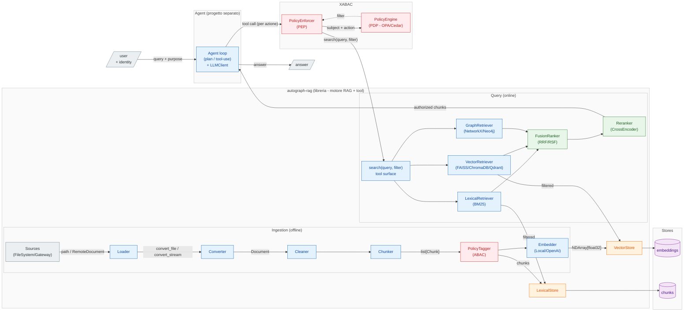
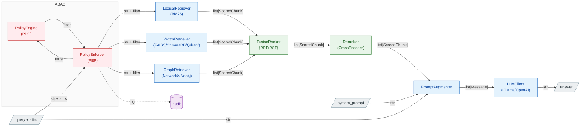

# Roadmap — multi-source + ABAC

Estende [l'architettura di base](architecture.md) su due assi: più **sorgenti** in ingresso
(oltre al filesystem locale, sorgenti remote via HTTP con FHIR dietro un gateway esterno) e un
livello di **controllo accessi ABAC** che, dati gli attributi del richiedente, limita quali chunk
sono raggiungibili in retrieval.

## Stato (16 luglio 2026)

- **Ingestion multi-source — nel base, implementata.** Filesystem locale + sorgenti remote in pull
  via `ApiLoader`, split `Loader` (acquisizione) / `Converter` (parsing). È già descritta in
  [architecture.md](architecture.md): questo doc non la ridisegna, ne fissa le decisioni e ciò che
  resta da fare.
- **ABAC — visione futura, non ancora costruita.** È il grosso di questo documento.

> Le prime stesure ipotizzavano FHIR *dentro* la libreria (`FhirLoader`, `RawResource`, Loader
> Registry con `can_handle`) e un campo `attrs` ABAC nei tipi fin da subito. Superato: FHIR vive in un
> **gateway esterno** e **non** c'è nessun campo ABAC nei tipi finché l'ABAC non viene progettato.

## Architettura a tre livelli

Tre confini netti, ognuno un progetto/processo distinto:

1. **`autograph-rag` (questa repo) — motore RAG + superficie-tool.** Resta una libreria in-process.
   L'estensione ABAC aggiunge una `search(query, top_k, filter=...) -> list[ScoredChunk]` **pubblica**:
   è la superficie-tool e `filter` è la cucitura dove l'ABAC spinge il predicato nello store. Niente
   microservizio finché non serve.
2. **ABAC — enforcement a livello dato.** Il **PDP** compila `(subject, action, env)` in un **filtro**,
   il **PEP** lo pusha nella ricerca (pre-filter, mai post-filter). Attributi del subject dall'identità
   verificata, default-deny sui mancanti, audit come obligation. Start con filtro hand-written; OPA/Cedar
   solo quando le policy diventano condizionali.
3. **Agente — progetto separato che importa la lib.** Il loop agentico vive fuori da questa repo e chiama
   `search(...)` come tool. Il **PEP avvolge ogni tool-call** (non una sola query) con l'**identità
   dell'utente immutata** lungo il loop (no confused deputy); è anche il contenimento contro la prompt
   injection.

Filo conduttore — un solo confine ripetuto ovunque: 
> chi decide il filtro sta a monte, chi lo applica sta nello store

Vale identico per la query lineare e per l'agente; cambia solo che l'agente
invoca il PEP a ogni passo.

**Verso un servizio esterno.** Questa architettura *logica* non cambia: un servizio è una scelta di
*deployment* ortogonale. Gli archi che attraversano il confine di processo diventano chiamate di rete e
i contratti (`search`, richiesta/decisione PDP) diventano schemi d'API — motivo per cui vanno definiti
puliti adesso. Primo candidato all'estrazione: il **PDP** (es. OPA server), dove solo `PEP → PDP` diventa
una call HTTP. Si aggiungono concern additivi (propagazione attrs, auth tra servizi, timeout/retry, audit
centralizzato), non un ridisegno.



I box sono confini di progetto/processo; `search(query, filter)` e la richiesta al PDP sono le cuciture
che, verso un servizio esterno, diventano API senza cambiare il flusso. `PolicyTagger` (ingestion) e il
ramo `XABAC` (query) sono le uniche aggiunte rispetto al [base](architecture.md); tutto il resto esiste già.

## Acquisizione ≠ parsing (nel base)

Due assi ortogonali in due astrazioni distinte — già implementate; qui solo il razionale che regge le
estensioni.

- **`Loader`** → *acquisizione*: dove stanno i dati e come tirarli giù. `LocalLoader`/`FileSystemLoader`
  (file su disco, passa un **path**) e `RemoteLoader`/`ApiLoader` (pull HTTP, passa **byte**). Qui vivono
  auth, paginazione, retry, streaming.
- **`Converter`** → *parsing*: trasforma un payload grezzo in testo/markdown in base al **formato**.
  `MarkdownConverter` fa dispatch sul `media_type` (tabella `_PARSER_BY_MEDIA_TYPE`): Docling per
  PDF/DOCX/PPTX/immagini, MarkItDown per CSV/JSON/XLSX/HTML, decode per `text/*`, fail-loud sul resto.

Il routing formato→parser sta **nel converter**, condiviso da filesystem e remoto: un PDF è parsato allo
stesso modo da qualunque sorgente arrivi.

**FHIR non entra qui.** È un *gateway esterno* (altra repo) a parlare FHIR — auth, consenso, paginazione
dei `Bundle`, risoluzione dei `Binary` — e a consegnare alla lib documenti neutri via HTTP: solo "byte +
`media_type`". Sostituisce l'idea originaria di un `FhirLoader`/`RawResource`/Loader Registry in-process.

```python
class RemoteDocument(BaseModel):          # ciò che il gateway garantisce
    data: Base64Bytes                     # payload grezzo (base64 in transito)
    media_type: str                       # "application/pdf", ...
    external_id: str; title: str; ingested_at: date

class BaseLoader(ABC):                     # acquisizione
    def load(self) -> Iterator[Document]: ...       # yield, streaming, skip-per-item

class BaseConverter(ABC):                  # parsing
    def convert_stream(self, data: bytes, media_type: str, name: str = "document") -> str: ...
    def convert_file(self, path: Path) -> str: ...
```

Gli attributi ABAC (`attrs`) **non** stanno nei tipi: rimandati a quando l'ABAC verrà progettato. Il
gancio naturale sarà un metadata generico sul chunk, scritto dal `PolicyTagger` in ingestion.

## Query con enforcement ABAC (target)

Principi non negoziabili:

- La sicurezza si applica **a livello dato, in fase di retrieval — mai in post-filtering** dopo il ranking
  (post-filtrare rompe il top-k e fa leak di *esistenza*).
- **L'LLM non è il confine di sicurezza**: vede solo chunk già autorizzati.
- Ogni decisione è loggata (audit obbligatorio per compliance).



### PEP, PDP, PIP e attributi

Terminologia dal modello ABAC classico (XACML): separa *chi applica* la regola da *chi la decide*.

- **PEP — Policy Enforcement Point.** Il guardiano sul percorso del dato: intercetta la richiesta, chiede
  la decisione al PDP e la **applica**, traducendola in un filtro pushato nella ricerca dei retriever. Non
  conosce le policy — sa solo bloccare/lasciar passare.
- **PDP — Policy Decision Point.** Il cervello: non tocca i dati, riceve `subject + action (+ resource +
  env)`, valuta le policy e restituisce un **predicato di filtro** (es. `tenant == "acme" AND
  classification <= "internal"`). Sostituibile senza toccare la pipeline: prima hand-written, poi OPA/Cedar.
- **PIP — Policy Information Point.** Sorgente per gli attributi **non presenti nel token**, risolti a
  decision-time (es. reparti correnti dell'utente, consenso del paziente ancora valido).

Il filtering non usa solo attributi noti all'auth. Gli attributi sono di quattro tipi e il match avviene a
runtime tra *subject* e *resource*:

| Categoria | Esempio | Origine |
|---|---|---|
| **Subject** | ruolo, tenant, clearance | token/identità (spesso noto all'auth) o PIP |
| **Resource** | classification del chunk, patient_id, source_system | metadata dello store (scritti dal `PolicyTagger` in ingestion) |
| **Action** | read / search | dalla richiesta |
| **Environment** | ora, IP, purpose-of-use, break-glass | contesto per-richiesta |

Conseguenza: `purpose-of-use` ed environment sono **per-richiesta, non per-sessione** (stesso login, filtro
diverso tra una query "per cura" e una "per ricerca") — per questo viaggiano con la query, non col login. Se
il caso reale confrontasse solo attributi statici del token contro tag statici del chunk (multi-tenancy pura),
il filtro degenera in qualcosa di noto all'auth: è il motivo per cui allo step 3 basta la versione
hand-written, tenendo PIP e OPA per quando servono attributi dinamici o consenso.

## Decisioni prese (priorità: semplicità)

- **FHIR fuori dalla lib, da subito** — gateway esterno in pull via `ApiLoader`; isola
  credenziali/compliance sanitaria fuori dal motore RAG.
- **La lib parsa i payload**, non il gateway: pipeline di estrazione unica, qualità controllata dalla lib
  (il gateway consegna byte grezzi + `media_type`).
- **Acquisizione (`Loader`) ≠ parsing (`Converter`)**; routing formato→parser nel converter su
  `media_type`, non un Loader Registry.
- **`load()` con `yield` + skip-per-item**: un file/record guasto viene saltato e loggato, non aborta il batch.
- **Nessun campo ABAC nei tipi** finché non si progetta; il gancio sarà un metadata generico sul chunk.
- **ABAC minimo prima del motore** *(futuro)*: 1–2 attributi come tag nel metadata + funzione che traduce
  gli attributi del subject in un metadata-filter pushato nella ANN search. OPA/Cedar/Casbin **solo** quando
  le policy diventano condizionali/gerarchiche.
- **Multi-tenancy** *(futuro)*: singola collection + filtro; namespace/collection per tenant o tier di
  classificazione se serve isolamento forte; con pgvector, Row-Level Security come difesa in profondità.

## Sequenza di rilascio

1. ✅ **Fatto — split acquisizione/parsing (in-process)**: `BaseLoader` (Local/Remote) + `ApiLoader` (pull
   HTTP), `BaseConverter`/`MarkdownConverter` con dispatch su `media_type`, `RemoteDocument` come contratto
   neutro, `load()` con `yield` + skip-per-item. *No FTP, no policy engine, no `attrs`.*
2. **Gateway FHIR (altra repo)** — servizio esterno che parla FHIR e alimenta la lib via `ApiLoader`.
   Cablaggio nella lib: aggiungere `gateway_url` a `Settings` e scegliere filesystem/gateway all'avvio.
3. **ABAC hand-written** — `PolicyTagger` in ingestion + metadata-filter pushdown a retrieval; qui si
   aggiunge un metadata generico sul chunk (i campi si decidono in quel momento) e la `search(query, filter)`
   pubblica.
4. **Solo se serve** — OPA/Cedar quando le policy diventano condizionali; eventuali altri connettori.
</content>
</invoke>
